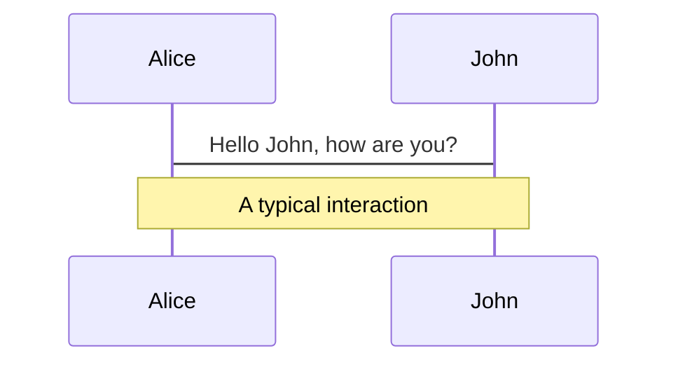
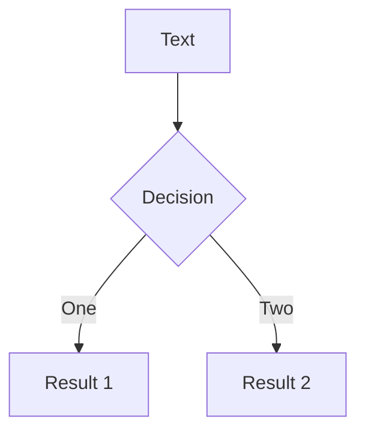

社群沟通的方式多了，`qq群` `微信呀` `各种圈子`，刚上班的时候，我也经常在群里看大家发的动图，这是一种在一整天无聊大编码过程中，一种乐趣。知识分享的平台也多了 `掘金`等等，也可以看看刷刷，但是有一个圈子是怎么也逃不掉的，`GitHub`。如果你检索 `vite` [https://github.com/search?o=desc&q=vite&s=stars&type=Repositories](https://github.com/search?o=desc&q=vite&s=stars&type=Repositories) ，仓库中排名第二的便是[https://github.com/slidevjs/slidev](https://github.com/slidevjs/slidev)也是今天分享的主角。

我不单单写文章，有时候写录点视频，在和别人分享内容的时候，如果有`PPT`是锦上添花的事情，但是对于我而言，有一个 bug，那就是非常不擅长作 PPT。我毕设答辩的时候，写 PPT 费了老劲了。

说一下背景：
如果你写`react` 的话，可能用过 `Ant Design` [https://ant.design/index-cn](https://ant.design/index-cn)。在首页的最下面，


有一列讲的是 **更多产品** ，排在第一个就是 `语雀`。我个人觉得这个产品的名字起的非常好。这是链接 [https://www.yuque.com/dashboard](https://www.yuque.com/dashboard) 说实话我一段时间没打开了，也改版了，在很久之前也有移动 APP 端。不过我看现在怎么收费了，我记得之前是可以写 PPT 的，难道我记错了？？不管怎么变化吧，我仍然觉得 `语雀` 是个很好的产品，但今天它不是主角

[https://docs.qq.com/desktop](https://docs.qq.com/desktop) 没错，这个是 `腾讯文档`，可以写 PPT，我在 2022 年初的时候简单使用过。这是一些模板 [https://docs.qq.com/mall/index/slide?u=6b06b4c590e24135b18eb56afac7b015&from_page=doc_list_new](https://docs.qq.com/mall/index/slide?u=6b06b4c590e24135b18eb56afac7b015&from_page=doc_list_new)，

[阶段小结]

1、上述的两个方案，是云文档的方式，没有本地的文件传来传去的尴尬。但是有一点是这些内容都在一些三方的服务上
2、比传统的用 `wps` 等等写 PPT 方便多了，
3、语雀有自己的生态，很多开发者在上分享内容；腾讯文档呢特别依赖一个账号，要么自己的微信，qq 什么的
4、过于繁杂的流程，让我每次想新建个 ppt 的时候就停止了，仅仅在新建这一步。
5、当然了，这种类似的方案很多，不过我们今天专注于 `PPT的制作` 也就是幻灯片

在很久之前，闲逛 `GitHub` 的时候，发现了 [Presentation Slides for Developers](https://github.com/orgs/slidevjs/repositories?q=&type=all&language=&sort=stargazers)

我截止目前还是个 **使用者** 的角色，不过也可以看看一些 repo。按照 `star数`排行的话 [https://github.com/search?o=desc&q=Slidev&s=stars&type=Repositories](https://github.com/search?o=desc&q=Slidev&s=stars&type=Repositories)。有几个结论

1、Slidev 的生态相对 `vite` 啊等等还没那么“热闹”，我猜测是因为它是解决特定问题的原因，还没那么开发者用，因为他们还不需要时长讲演。
2、作者是 `antfu` ，看看他的知乎，可以看出他是很在意自己的这个作品，当然了，他的作品可不仅仅是这个，不仅仅只有这个。

![图片 支付问题的提问]

3、还有就是我们在 `vscode` 中有插件用 [https://marketplace.visualstudio.com/items?itemName=antfu.slidev](https://marketplace.visualstudio.com/items?itemName=antfu.slidev)

## Sli dev

接着看文档吧，毕竟我还停留在用的层面。像 `vitepress` 等等这种方案，在面试的时候很少考察原理，那么这种方案我大概认为，是解决了特定问题的优秀方案，先不着急搞明白怎么实现的。我有几点体会

1、社区中有很多相似的轮子，这对刚开始学内容的的同学来说容易走弯路，就拿我来说，当初我学 node，就认为要把 `express` `koa` `egg` 等等甚至 `nestjs` 全部掌握才算会点 node。这种基于 node 上层的封装太多了，“眼花缭乱的”

2、当我第一次发现 `Slidev` 的时候，我就发现太酷了，这才是应该多多出现的轮子啊。不过刚开始我不会读，不知道啥意思，为啥叫 `Slidev`

3、文档太友好了，各种语言的。非常赞

> Slidev 并不寻求完全取代其他幻灯片制作工具。相反，它专注于迎合开发者社区的需求。

至少它解决了我最初提到的问题

1、我写 PPT，直接新建了仓库，然后写代码就好了，把代码提到 `GitHub` 服务器

2、我不必登录各种账号，甚至我也不用充会员解锁 ppt 模板。

3、我不用装个本地的 wps ，然后还要想着这个 ppt 文件放在电脑的哪个文件夹下，在没在 `C盘`

4、还有就是我在做视频分享的时候，可以直接用代码，跑起来就直接讲演了。

### 这很酷

1、你会`Markdown 语法` ，就能写幻灯片，这和写博客高度统一
2、社区中有一些现成的模板 [https://cn.sli.dev/themes/gallery.html](https://cn.sli.dev/themes/gallery.html)

3、你某一页中的代码片段，一流支持，支持 html vue

4、非常快，就是快，即时重载

5、可以录制、能导出为 PDF 或 PNG

6、感叹 `web` 能力的伟大吧，两个字表达我对这个作品的评价：优雅

### 快速开始

> Slidev 会读取位于项目根目录的 slides.md 文件，并将其转换为幻灯片

如果没有这个文件的话，控制台会提示

```ts {2}
console.log('this is 1')
console.log('this is 2')
```

在`md` 这样写，第 2 行的 `console.log('this is 2')` 会高亮

> 你也可以在 Markdown 的文本描述中创建图形或图表

这其实是我自己的一个需求场景，我一直希望能在 md 里直接写自己的一些“点子” ，不想用 `xmind` ，后来发现 **mermaid**。这样我就可以直接在写文章的时候直接写思维导图，当然现在在 `PPT` 的时候也可以了。



---



导出图片的前提需要安装一个包

```sh
pnpm i -D playwright-chromium
```

执行`slidev export --format png` ，之后会在项目的根目录生成一个文件夹 `slides-export`

关于幻灯片的尺寸，可以打开控制台，看看这个元素

```html
<div
  id="slide-content"
  style="height: 552px; width: 980px; transform: translate(-50%, -50%) scale(1.69977);"
>
  xxxxx
</div>
```

> 幻灯片被定义为固定尺寸（默认为 980x552px），并会跟随用户屏幕进行缩放。你可以安全地在你的幻灯片中使用绝对定位，因为它们会随着屏幕的缩放而变化

视图的尺寸变化大概是通过`transform: translate(-50%, -50%) scale(0.404082);` 然后浏览器窗口发生的变化的时候，做到适配不同的屏幕，因为讲演的`PPT` 是要能够兼容各种大屏的。看文档看到这儿的时候，让我想起之前的写的一个 `vue` 组件。

```js
// 导入 vueuse 包，集成一些 utils
import { useDebounceFn } from '@vueuse/core'
// 这里的width 和 height 是外层组件传进来的默认宽度和高度
const props = defineProps({
  width: Number,
  height: Number,
})
const domStyle = reactive({
  width: `${props.width}px`,
  height: `${props.height}px`,
  transform: 'scale(1) translateX(-50%)', // 缩放主要是这个transform
  transformOrigin: '0 0',
})
// 设置当前的缩放
const scaleSetter = () => {
  const baseWidth = document.documentElement.clientWidth
  // set domStyle
  domStyle.transform = `scale(${scaleGetter()}) translateX(-50%)`
  domStyle.width = `${baseWidth / scaleGetter()}px`
}
// 获取当前的缩放
const scaleGetter = () => {
  const baseWidth = document.documentElement.clientWidth
  const baseHeight = document.documentElement.clientHeight
  const x = baseWidth / props.width
  const y = baseHeight / props.height
  const ret = x < y ? x : y
  return ret
}

const debouncedFn = useDebounceFn(() => {
  scaleSetter()
}, 300)
// 页面初始化的时候 监听
const eventHandler = () => {
  window.addEventListener('resize', debouncedFn)
}
// 页面不在的时候 移除
const removeEventHandler = () => {
  window.removeEventListener('resize', debouncedFn)
}
```

### 扩展一点的内容

1、你可以在 [https://www.npmjs.com/search?q=keywords%3Aslidev-theme](https://www.npmjs.com/search?q=keywords%3Aslidev-theme) 查看或使用一些现有的主题

### 一些经验

1、在安装的是有什么问题，可以自己现有电脑的 node 版本
2、用到什么模块的时候，再去深究对应文档的上的内容
